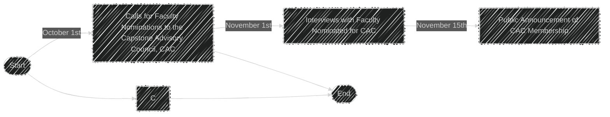

```mermaid
  graph TD;
      A-->B;
      A-->C;
      B-->D;
      C-->D;
```

```mermaid
---
config:
      look: handDrawn
      theme: dark
---
flowchart LR;
      A([Start])-->|October 1st| B[Calls for Faculty Nominations to the Capstone Advisory Council, CAC];
      B-->|November 1st| E[Interviews with Faculty Nominated for CAC]
      E-->|November 15th| F[Public Announcement of CAC Membership]
      A-->C;
      B-->D;
      C-->D([End]);
```
