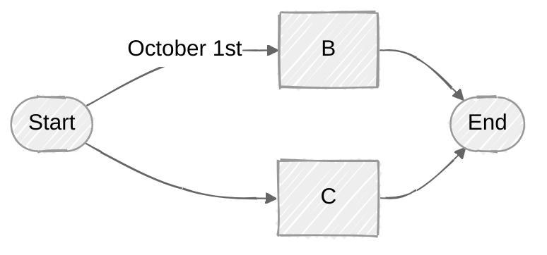

```mermaid
  graph TD;
      A-->B;
      A-->C;
      B-->D;
      C-->D;
```

```mermaid
---
config:
      look: handDrawn
      theme: neutral
---
flowchart LR;
      A([Start])-->|October 1st| B;
      A-->C;
      B-->D;
      C-->D([End]);
```
